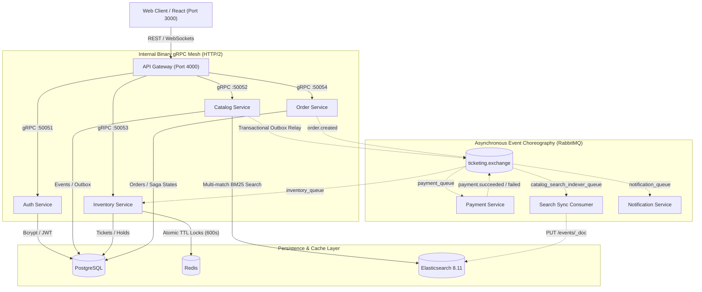

# TicketHub 🎟️

A high-throughput, distributed event ticketing and secondary fan-to-fan resale platform built with **NestJS**, **gRPC**, **RabbitMQ**, **Elasticsearch 8.11**, **Redis**, **PostgreSQL**, **React 18 (shadcn/ui)**, and **Kubernetes**.

Engineered to handle **1,000,000+ live stadium events**, sub-30ms typo-tolerant search, atomic 10-minute seat holds with zero double-booking, and resilient distributed Saga checkout workflows.

---

## 🏗️ System Architecture



---

## ⚡ Core Capabilities & Architectural Patterns

### 1. Sub-30ms Distributed Search over 1,000,000+ Events
- **Elasticsearch 8.11 Cluster**: Inverted index configured with custom ASCII-folding and lowercase analyzers.
- **Fuzzy Relevance (BM25)**: Instant tolerance against intentional or accidental typos (e.g., `"clodplay"` matches *Coldplay*, `"wembly"` matches *Wembley Stadium*, `"zimmar"` matches *Hans Zimmer*).
- **Benchmarked Performance**: Evaluated against 1,005,005 records — Elasticsearch resolved fuzzy typo queries in **~29ms**, outperforming SQL sequential scans by **18.8x**.

### 2. Transactional Outbox Pattern
- **Guaranteed Consistency**: Writes to PostgreSQL `events` and `outbox` occur atomically within a single ACID transaction.
- **Durable Event Publishing**: Background relay worker polls `PENDING` outbox records and dispatches them to RabbitMQ using **publisher confirms** (`confirmSelect`), marking records `PUBLISHED` only after persistent write to disk.

### 3. Distributed Saga Pattern (Order & Payment Choreography)
- **Choreographed Workflows**: Decoupled order placement, payment simulation, and ticket assignment via asynchronous RabbitMQ events.
- **Automated Compensating Rollback**: If a payment is declined or expires, a compensating event (`payment.failed`) automatically releases the seat lock in Redis and PostgreSQL, ensuring zero orphaned reservations.

### 4. Atomic Concurrency & Zero Double-Booking
- **10-Minute Cart Hold**: Seats are locked atomically via Redis `SET ticket:hold:{id} {userId} NX EX 600`.
- **Race Condition Immunity**: Concurrent requests competing for the exact same seat fail fast on the second attempt with immediate seat availability feedback.

### 5. Fan-to-Fan Resale Marketplace & Dynamic Pass Re-encryption
- **Secondary Marketplace**: Verified ticket holders can list confirmed tickets for peer-to-peer resale at capped face value.
- **Anti-Fraud Security**: Upon transfer, the seller's barcode signature is permanently revoked, and a fresh encrypted barcode entry pass is issued to the buyer.

### 6. Production shadcn/ui Web Experience
- **Consumer-Ready Design**: Sleek dark-mode interface built with Tailwind CSS, Lucide icons, and shadcn-styled primitives (`Button`, `Badge`, `Card`, `Dialog`, `Input`, `Tabs`, `Avatar`, `Separator`).
- **Interactive Venue Map**: Stadium stage visual with section categories (`VIP Lower`, `Section 102`, `General Standing`) and live hold status badges.
- **Digital Pass Vault**: Apple/Google Wallet-style passes with dynamic animated QR barcodes.
- **Server-Side Pagination**: Full pagination controls (`Previous`, `Next`, page buttons, items-per-page selector) respecting Elasticsearch result window guards.

---

## 📦 Microservices Topology

| Service | Transport | Port / Target | Persistence / Backing Store | Responsibility |
| :--- | :--- | :--- | :--- | :--- |
| **`web`** | HTTP / React | `:3000` (Nginx) | — | Production frontend client with debounced live search |
| **`api-gateway`** | HTTP + WebSocket | `:4000` (LoadBalancer) | Stateless | REST routing, WebSocket broadcasting, and gRPC client proxy |
| **`auth-service`** | gRPC | `:50051` | PostgreSQL (`users`) | JWT authentication, user registration, Bcrypt hashing |
| **`catalog-service`** | gRPC + Outbox Relay | `:50052` | PostgreSQL + Elasticsearch | Event catalog, outbox publisher, and search queries |
| **`inventory-service`** | gRPC + AMQP | `:50053` | Redis + PostgreSQL | Seat availability, atomic TTL holds, resale listings |
| **`order-service`** | gRPC + AMQP | `:50054` | PostgreSQL (`orders`) | Order state machine and Saga dispatch |
| **`payment-service`** | AMQP Worker | `payment_queue` | Escrow simulation | Payment processing and Saga compensation events |
| **`notification-service`** | AMQP Worker | `notification_queue` | Mailer / Pass dispatcher | Ticket dispatch and customer confirmations |
| **`elasticsearch`** | HTTP / Native | `:9200` | Lucene Index (1GB Heap) | Typo-tolerant BM25 search index over 1M documents |
| **`postgres`** | PostgreSQL Protocol | `:5432` | Persistent Volume | Relational storage for users, events, tickets, orders, outbox |
| **`redis`** | Redis Protocol | `:6379` | In-memory + RDB | Distributed concurrency locks and hold expiration timers |
| **`rabbitmq`** | AMQP 0-9-1 | `:5672` (Mgmt: `:15672`) | Durable Queues | Event exchange (`ticketing.exchange`) for Sagas and indexers |

---

## 🚀 Getting Started

### Prerequisites
- [Docker Desktop](https://www.docker.com/) with Kubernetes enabled
- [Node.js](https://nodejs.org/) v20+
- `kubectl` configured to your local cluster context

### 1. Installation
Clone the repository and install root dependencies:
```bash
git clone https://github.com/tsotne01/tkt-buy-sell.git
cd tkt-buy-sell
npm install
```

### 2. Deploy Infrastructure & Microservices to Kubernetes
Apply the Kubernetes manifests in topological order:

```bash
# 1. Core infrastructure
kubectl apply -f k8s/infra/postgres.yaml
kubectl apply -f k8s/infra/redis.yaml
kubectl apply -f k8s/infra/rabbitmq.yaml
kubectl apply -f k8s/infra/elasticsearch.yaml

# 2. Wait for infrastructure readiness
kubectl wait --for=condition=ready pod -l app=postgres --timeout=90s
kubectl wait --for=condition=ready pod -l app=elasticsearch --timeout=90s

# 3. Deploy microservices & web frontend
kubectl apply -f k8s/services/
```

Verify that all 12 pods are in `Running` status:
```bash
kubectl get pods
```

---

## 🌐 Accessing the Application

| Application | URL | Description |
| :--- | :--- | :--- |
| **Web Frontend** | [http://localhost:3000](http://localhost:3000) | Live ticketing web application |
| **API Gateway** | [http://localhost:4000](http://localhost:4000) | REST API endpoints & WebSockets |
| **RabbitMQ Management** | [http://localhost:15672](http://localhost:15672) | Queue metrics (User: `guest`, Pass: `guest`) |
| **Elasticsearch** | `http://localhost:9200` | Cluster health and index stats |

---

## 🧪 Verification & Benchmark Scripts

Run the comprehensive test suites included in the repository:

```bash
# Test 1: Elasticsearch distributed search, fuzzy typo tolerance, and transactional outbox
node scripts/test-elasticsearch-search.js

# Test 2: User registration, login, P2P resale listing, and Saga completion
node scripts/test-auth-and-resale.js

# Test 3: Real-time multi-client WebSocket seat hold & purchase broadcast
node scripts/test-websocket-sync.js

# Benchmark: High-speed ingestion of 1,000,000 events into PostgreSQL & Elasticsearch
node scripts/seed-1m-events.js
```

---

## 📁 Repository Structure

```
.
├── apps/
│   ├── api-gateway/            # Express/NestJS Gateway, REST controllers, WebSocket gateway
│   ├── auth-service/           # gRPC microservice for user accounts and JWT issuance
│   ├── catalog-service/        # gRPC microservice, Elasticsearch client, Outbox Relay
│   ├── inventory-service/      # gRPC microservice, Redis atomic locks, dynamic seating
│   ├── notification-service/   # RabbitMQ consumer for order receipts and pass dispatch
│   ├── order-service/          # gRPC microservice, Saga orchestrator
│   ├── payment-service/        # RabbitMQ consumer handling payment authorization
│   └── web/                    # React 18 client, Vite, Tailwind CSS, shadcn/ui components
├── packages/
│   ├── common/                 # Shared interfaces, AMQP event definitions, DTOs
│   └── proto/                  # Protobuf definitions and generated TypeScript contracts
├── k8s/
│   ├── infra/                  # Postgres, Redis, RabbitMQ, Elasticsearch specifications
│   └── services/               # Deployment and service specs for all microservices
└── scripts/                    # Automated testing, benchmarking, and bulk seeding scripts
```

---

## 📄 License
This project is licensed under the [MIT License](LICENSE).
